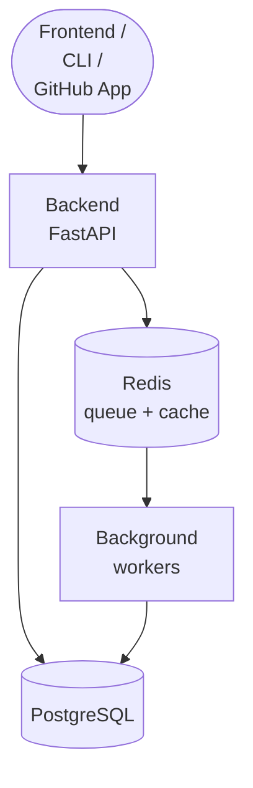

# DevSecureX - Security Code Review Platform

Comprehensive security scanning platform with AI-powered analysis, GitHub integration, and 16+ security tools.

> **Try it on GitHub**: this backend powers the **[DevSecureX Scanner](https://github.com/apps/devsecurex-scanner)** GitHub App, which automatically reviews pull requests for security issues.

> **Project Structure**: See [PROJECT_STRUCTURE.md](PROJECT_STRUCTURE.md) for detailed folder organization.
>
> This repository contains the **backend** service. It is designed to run alongside a
> separate React frontend and CLI, but runs standalone for API use.

## Features

### Core Capabilities
- **Multi-Language Security Scanning**: Support for 15+ programming languages and frameworks
- **GitHub Integration**: PR-based scanning, webhook support, automated reviews
- **AI-Powered Analysis**: Smart code fixes and vulnerability explanations via OpenAI
- **Real-time Processing**: Background workers with Redis queue management
- **Authentication**: OAuth integration with GitHub, JWT-based sessions
- **Scalable Architecture**: FastAPI with async processing and database optimization

### Security Tools Integrated
- **Static Analysis**: Semgrep, Bandit, ESLint Security, Psalm, Roslynator
- **Vulnerability Detection**: Trivy, TruffleHog, GitLeaks, Checkov
- **Language-Specific**: Gosec (Go), Brakeman (Ruby), SpotBugs (Java), CppCheck (C/C++)
- **Dependency Scanning**: Safety (Python), built-in package vulnerability detection

## Quick Start

### Prerequisites
- Python 3.12+
- Docker & Docker Compose
- PostgreSQL 15+
- Redis 7+

### Development Setup

1. **Clone and Setup**
```bash
git clone https://github.com/DevSecureX/backend.git
cd backend

# Copy environment configuration
cp .env.example .env
# Edit .env with your configuration
```

2. **Run with Docker**
```bash
# Start all services (recommended)
docker-compose up --build

# Backend: http://localhost:8010 (API docs: /docs)
# Frontend: http://localhost:5173
```

3. **Local Development (without full Docker)**
```bash
# Install dependencies
pip install -r app/requirements.txt

# Start supporting services
docker-compose up -d postgres redis

# Run the application
cd app && python main.py
```

### Testing

```bash
# Run the test suite
python -m pytest app/tests -v
```

## Documentation & Resources

- **Project Structure**: [PROJECT_STRUCTURE.md](PROJECT_STRUCTURE.md) — complete folder organization
- **API Docs**: interactive Swagger UI at `/docs` when the service is running
- **Test Samples**: `app/scans/test_vulnerabilities/` — intentionally vulnerable
  code samples used to validate the scanners (these contain deliberately fake
  credentials; they are test fixtures, not real secrets)

## API Documentation

### Core Endpoints
- `GET /health` - System health check
- `POST /auth/login` - User authentication
- `GET /repos` - Repository management
- `POST /scans/trigger` - Initiate security scan
- `GET /scans/{scan_id}` - Scan results and status

### Authentication
All API endpoints require JWT authentication except:
- `/health`
- `/auth/login`
- `/auth/register`
- `/webhooks/*` (webhook endpoints)

```bash
# Example API usage
curl -H "Authorization: Bearer <token>" \
     -X POST "http://localhost:8010/scans/trigger" \
     -d '{"repository_url": "https://github.com/user/repo", "branch": "main"}'
```

## Configuration

### Environment Variables

#### Required
- `DATABASE_URL`: PostgreSQL connection string
- `REDIS_URL`: Redis connection string
- `SECRET_KEY`: Application secret key
- `GITHUB_CLIENT_ID`: GitHub OAuth client ID
- `GITHUB_CLIENT_SECRET`: GitHub OAuth secret

#### Optional
- `SCAN_WORKERS`: Number of background workers (default: 2)
- `LOG_LEVEL`: Logging level (default: INFO)
- `OPENAI_API_KEY`: For AI features
- `CORS_ORIGINS`: Allowed frontend origins

### Database Setup

```sql
-- Create database
CREATE DATABASE devsecurex_db;
CREATE USER devsecurex_user WITH PASSWORD 'devsecurex_pass';
GRANT ALL PRIVILEGES ON DATABASE devsecurex_db TO devsecurex_user;
```

## Deployment

### Production with Docker

```bash
# Build production image
docker build -t devsecurex-backend:latest .

# Run with environment file
docker run --env-file .env -p 8010:8010 devsecurex-backend:latest
```

### Docker Compose Production

```bash
# Use the production compose file (API + workers + PostgreSQL + Redis)
docker-compose -f docker-compose.production.yml up -d
```

### Manual Deployment

```bash
# Install production dependencies
pip install -r requirements.txt

# Run with Gunicorn
pip install gunicorn
gunicorn app.main:app -w 4 -k uvicorn.workers.UvicornWorker --bind 0.0.0.0:8010
```

## Architecture

### System Components



### Scanning Pipeline

1. **Trigger**: PR webhook or manual scan request
2. **Queue**: Job added to Redis queue for processing
3. **Worker**: Background worker picks up scan job
4. **Analysis**: Multiple security tools run in parallel
5. **AI Enhancement**: OpenAI processes results for fixes/explanations
6. **Storage**: Results stored in PostgreSQL with caching in Redis
7. **Notification**: GitHub PR comments, webhooks, real-time updates

## Development

### Code Standards
- **Python**: PEP 8 compliance, type hints required
- **API**: OpenAPI/Swagger documentation for all endpoints
- **Testing**: 90%+ test coverage for core modules
- **Security**: All inputs validated, SQL injection prevention, rate limiting

### Contributing

```bash
# Setup development environment
python -m venv venv
source venv/bin/activate  # Linux/Mac
pip install -r app/requirements.txt

# Run tests before committing
python -m pytest app/tests -v

# Code formatting
black app/
isort app/
```

### Database Migrations

```bash
# Generate migration
alembic revision --autogenerate -m "description"

# Apply migrations
alembic upgrade head
```

## Monitoring & Observability

### Health Checks
- `/health` endpoint reports database, Redis, and worker status
- Docker healthchecks configured for container orchestration
- Prometheus metrics available at `/metrics`

### Logging
- Structured JSON logging for production
- Log levels: DEBUG, INFO, WARNING, ERROR, CRITICAL
- Separate log files for different components (auth, scans, workers)

### Performance
- Background job processing prevents blocking requests
- Redis caching for frequently accessed data
- Database connection pooling and query optimization
- Rate limiting prevents abuse

## Security

### Authentication & Authorization
- JWT tokens with configurable expiration
- GitHub OAuth integration
- Role-based access control (RBAC)
- API rate limiting and request validation

### Data Protection
- Environment variable configuration
- Database connection encryption
- Sensitive data hashing (passwords, tokens)
- CORS policy enforcement

### Vulnerability Management
- Regular dependency updates via Dependabot
- Container image scanning in CI/CD
- Security tool self-scanning (dogfooding)
- Penetration testing integration points

## Troubleshooting

### Common Issues

**Database Connection Errors**
```bash
# Check database status
docker-compose exec db pg_isready -U devsecurex_user

# View database logs
docker-compose logs db
```

**Redis Connection Issues**
```bash
# Test Redis connectivity
docker-compose exec redis redis-cli ping

# View Redis logs
docker-compose logs redis
```

**Scanning Tool Failures**
```bash
# Verify tool installations
docker-compose exec backend trivy --version
docker-compose exec backend semgrep --version

# Check worker logs
docker-compose logs backend | grep -i worker
```

## Support & Documentation

- **API Documentation**: interactive Swagger UI at `/docs` when the service is running
- **Project Structure**: [PROJECT_STRUCTURE.md](PROJECT_STRUCTURE.md)

## License

Released under the [MIT License](LICENSE). DevSecureX invokes several third-party
security scanners as separate programs (not bundled) — see
[THIRD_PARTY_NOTICES.md](THIRD_PARTY_NOTICES.md) for their licenses.

---

**DevSecureX** — built by [Harshal Tribhuvan](https://github.com/harshaltribhuwan).
Professional-grade security scanning for modern development teams.